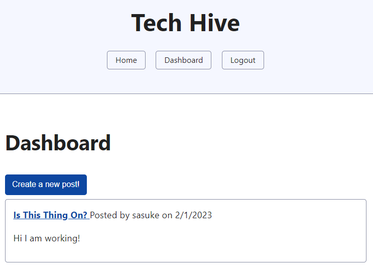
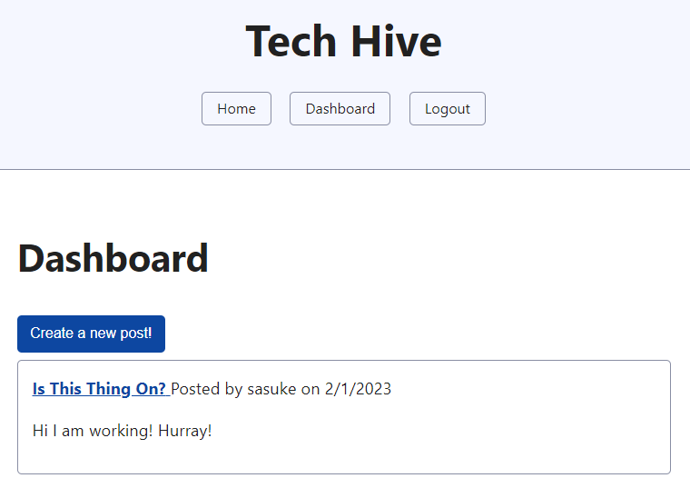

# tech-hive

[Link to my project](https://github.com/Deiontre10/tech-hive)
[Link to deployed site](https://protected-island-47579.herokuapp.com/)

## Table of Contents
- [Description](#description)
- [Visuals](#visuals)

## Description

Tech Hive is a dynamic blog platform where users can create, edit, and delete their own posts. The site also features a commenting system, allowing users to engage with others and share their thoughts on the various posts. However, to take advantage of these features, users must first log in to the site. With Tech Hive, users have the power to shape and share their own technological insights and opinions with the online community.

## Visuals

Dashboard:  

Edit Post:  

New Post:  

Post:  

Updated Post:  
